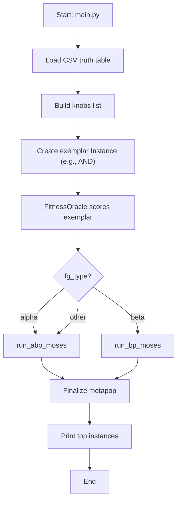
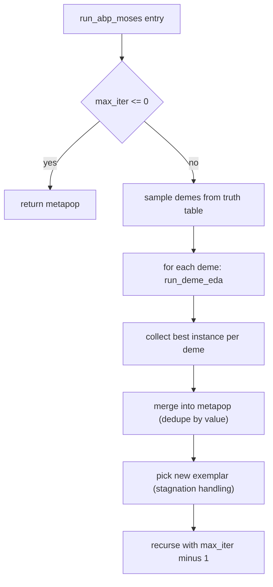

# MOSES-MORK


## 1) What this project is

**MOSES‑MORK** is a Python implementation/prototype of a scalable MOSES-like evolutionary program search workflow, designed to align with the **MORK / Hyperon Atomspace** ecosystem.

At a high level, the system learns boolean programs (represented as S‑expressions such as `(AND A (OR B C))`) from truth-table data and iteratively improves them using:

- **Sampling** of candidate program “demes” (neighborhoods around an exemplar)
- **Selection** of fitter candidates
- **Dependency mining** (discover correlated sub-expressions)
- **Factor graph construction** from mined dependencies
- **PLN-style truth-value revision/deduction** across generations
- **Variation operators** (crossover + mutation), optionally guided by learned “STV” values
- **Canonicalization / reduction** via an Elegant Normal Form reducer (ENF) implemented in `reduct/enf/`

The repository includes two “strategies”:
- **Alpha path** (`run_abp_moses`) — deme sampling + EDA on each deme.
- **Beta path** (`run_bp_moses`) — uses a Beta-distribution factor graph and evidence propagation to drive variation.

---

## 2) Repository structure (main)

Top-level:
- `main.py` — runnable script + unified `run_moses(...)` wrapper
- `README.md` — conceptual architecture overview
- `requirements.txt` — Python dependencies (notably `hyperon`)
- Packages:
  - `Moses/` — outer loop implementations
  - `Representation/` — core data structures, utilities, sampling and selection
  - `DependencyMiner/` — pattern/dependency mining over program trees
  - `FactorGraph_EDA/` — factor-graph EDA pipeline and Beta factor graph
  - `Variation_quantale/` — crossover/mutation operators (quantale-inspired)
  - `Feature_selection_algo/` — feature selection used during deme sampling
  - `reduct/` — ENF reducer and supporting code (Hyperon atom registration)
- `example_data/` — example truth tables (CSV)
- `scripts/run_tests.py` — unittest discovery runner
- `Resources/` — diagrams + PDFs

---

## 3) Installation & running

### 3.1 Install dependencies
From repo root:
```bash
pip install -r requirements.txt
```

Key dependency: `hyperon==0.2.9` (used both for MeTTa integration and reducer invocation).

### 3.2 Run the demo
```bash
python main.py
```

By default, `main.py` loads:
- `example_data/test_bin.csv` with output column `O`
- sets hyperparameters
- starts from exemplar `(AND)`
- runs `run_moses(..., fg_type="beta")`

You can switch to alpha mode by changing:
```python
fg_type="alpha"
```

---

## 4) Core domain objects (Representation)

### 4.1 `Representation/representation.py`

This file defines the core types used everywhere else.

#### `Quantale` (abstract base class)
A conceptual interface for algebraic composition:
- `join(parent1, parent2)`
- `product(parent1, parent2)`
- `residium(parent1, parent2)`
- `unit()`

In practice:
- `Variation_quantale/*` uses these ideas concretely (sets + masks).
- `Deme` inherits `Quantale` but leaves most operations TODO.

#### `KnobVariable`
Represents a “hole” / decision point and its allowed domain. (More conceptual in current code.)

#### `Factor` + `FactorGraph`
A basic factor graph abstraction:
- `Factor.evaluate(...)` returns a potential value for assigned variable values.
- `FactorGraph.neighbors(var)` lists factors containing the variable.

> Note: the **main EDA factor-graph used by the algorithm** is implemented in `FactorGraph_EDA/factor_graph.py`, not this older/general `FactorGraph` class.

#### `Knob` (dataclass)
Represents an input symbol (like `A`, `B`, etc.) and its truth values.

Fields:
- `symbol: str`
- `id: int`
- `Value: List[bool]` (note capital V in code)

#### `Instance` (dataclass)
Represents a candidate program:
- `value`: S-expression string (e.g. `(AND A (NOT B))`)
- `id`: instance id
- `score`: fitness score
- `knobs`: list of `Knob` objects used

It also includes `_get_complexity()` which approximates program complexity by token-counting (used for tie-breaking).

#### `Hyperparams` (dataclass)
Controls mutation/crossover and sampling:
- mutation_rate
- crossover_rate
- num_generations
- neighborhood_size
- bernoulli_prob / uniform_prob (used in sampling)

#### `Deme`
A neighborhood of `Instance`s, tracked across generations, with optional `factor_graph`.

---

## 5) Fitness, scoring, and population management

Fitness is referenced via `FitnessOracle` (imported from `Representation.representation` in `main.py` / MOSES loops). The details appear to be defined somewhere in `Representation/representation.py` beyond the snippet shown; the algorithm assumes:

- `fitness.get_fitness(instance)` produces `instance.score` in [0,1] (best_possible_score=1.0 used in beta mode termination).

Metapopulation (“metapop”):
- Top-level list collecting best individuals across iterations/demes.
- `_finalize_metapop` in `Moses/run_bp_moses.py` deduplicates by `inst.value`, sorts by score and complexity, prints top 10.

---

## 6) Sampling (deme creation)

### 6.1 `Representation/sampling.py`

This module creates demes around an exemplar and generates candidate expressions.

Key ideas:
- Generate logical “permutations” (new feature proposals) based on current operator:
  - If exemplar root op is AND, propose OR pairs; if OR, propose AND pairs.
- Uses feature selection (`Feature_selection_algo`) to pick which knobs/features to focus on.
- Uses ENF reduction via:
  - `from reduct.enf.main import reduce`
  - `MeTTa()` runtime (Hyperon)

Important functions:
- `sample_logical_perms(current_op, variables)` → candidate sub-expressions
- `randomUniform(...)` → select items probabilistically
- `randomBernoulli(...)` → mutate exemplar by probabilistically inserting/replacing features, prune duplicates, etc.

Also referenced:
- `sample_from_TTable(csv_path, hyperparams, exemplar, knobs, target, output_col='O')`
  - This is called by `run_abp_moses` to produce demes.

> Conceptually, this is where the search neighborhood is built: you start with an exemplar and generate a set of “nearby” candidate programs grouped into demes.

---

## 7) Selection

### 7.1 `Representation/selection.py`

Two selection strategies:
- `select_top_k(deme, k)` — sort by `inst.score`, return first k
- `tournament_selection(deme, k, tournament_size)` — standard tournament selection

Used by:
- `Moses/run_bp_moses.py` for selecting exemplars for crossover/mutation.
- `run_abp_moses` uses `select_top_k` indirectly through EDA.

---

## 8) Dependency mining

### 8.1 `DependencyMiner/miner.py`

This discovers correlated program parts (subtrees / sibling co-occurrences).

There are two miners:

#### `OrderedTreeMiner`
- Enumerates **induced subtrees** rooted at each node (preserving parent-child)
- Counts document frequency (support) per expression tree
- `get_frequent_patterns()` returns patterns filtered by `min_support`

#### `DependencyMiner`
Main miner used in beta MOSES and EDA.
It focuses on **sibling co-occurrences inside a parent context**:
- For each non-leaf node with multiple children, treat children as a “context”
- Count:
  - single occurrences (`single_counts`, `single_weights`)
  - pair occurrences (`pair_counts`, `pair_weights`)
- Tracks `total_weighted_contexts` for normalization

The output of `DependencyMiner.get_meaningful_dependencies()` (called in `Moses/run_bp_moses.py`) is used to create rules/factors such as:
- `"A -- (NOT B)"` with `(strength, confidence)`

Those become edges in a factor graph / evidence model.

---

## 9) Factor-graph EDA (alpha path)

### 9.1 `FactorGraph_EDA/factor_graph.py`

Defines the factor graph used by the EDA loop:

- `SubtreeVariable(name, marginal_stv)`
  - `marginal_stv = (strength, confidence)` describing how likely a subtree is present
- `PairwiseFactor(var_a, var_b, stv, inferred=False)`
  - Stores in sorted order for stable keys
  - `stv` also `(strength, confidence)`
- `FactorGraph`
  - `variables: Dict[name, SubtreeVariable]`
  - `factors: Dict[(a,b), PairwiseFactor]`
  - `neighbors(var_name)` returns all adjacent factors
  - `neighbor_names(var_name)` returns adjacent variable names

This representation is used by `eda.py` to revise/deduce and sample.

### 9.2 `FactorGraph/pln.py`

Implements PLN truth-value algebra on STVs:
- `revision(stv1, stv2)` — merge evidence (confidence grows)
- `deduction(stv_ab, stv_bc, s_b)` — infer A→C from A→B and B→C
- `negation(stv)` — flip strength
- `modus_ponens(stv_a, stv_ab)` — infer B

Used in `FactorGraph_EDA/eda.py` to:
- revise variables/factors across generations
- deduce missing edges to “fill gaps” in factor graph structure

### 9.3 `FactorGraph_EDA/eda.py`

This file is the core of the alpha EDA pipeline.

It provides a staged workflow:

#### Stage 1: Miner → Factor graph
`build_factor_graph_from_miner(miner, dependencies)`:
- Variables come from `miner.single_weights`
  - strength = weight / total_weighted_contexts
  - confidence = `w2c(count)` (more observations = higher confidence)
- Factors come from “meaningful dependencies”
  - each becomes `PairwiseFactor(var_a, var_b, stv)`

#### Stage 2: Revision across generations
`revise_factor_graph(new_fg, old_fg)`:
- For shared variables/factors: apply `revision`
- For old-only items: carry forward with decayed confidence (×0.9)

#### Stage 3: Deduction
`apply_deduction(fg)`:
- For each pair of factors sharing a pivot variable (A‑B and B‑C), infer A‑C if missing.
- Mark inferred factors as `inferred=True` with lower confidence.

#### Stage 4+: Deme EDA loop (run_deme_eda)
`run_deme_eda(...)` is called by `run_abp_moses`:
- Select top k
- Mine dependencies (DependencyMiner)
- Build + revise + deduce factor graph
- Sample new candidates consistent with learned distribution
- Score and update deme
- Return best instance and factor graph

---

## 10) Beta factor graph (beta path)

### 10.1 BetaGraph / BetaFactorGraph (`FactorGraph_EDA/beta_bp.py`)

#### What it is (conceptually)
`BetaFactorGraph` is a lightweight belief network where each “node” is a feature/subtree name and its belief is represented as a **Beta distribution**.

Beta distributions are natural for modeling probabilities of Bernoulli-like events such as:

> “Is feature X present in good programs?”  
> “Should I include subtree Y during variation?”

Each node maintains a **BetaState** with:
- `alpha` (pseudo-count of positive evidence)
- `beta`  (pseudo-count of negative evidence)

From that it derives:
- `strength = alpha / (alpha + beta)` (mean probability)
- `confidence = (alpha + beta) / (alpha + beta + 1)` (saturating evidence amount)

### 10.2 What a “rule/factor” is in this beta graph
Instead of classic factor potentials, `BetaFactorGraph` stores a list of dependency rules:

```python
{ "src": ..., "dst": ..., "s": strength, "c": confidence }
```

These rules come directly from mined dependencies (the miner output). The idea is:

- If `src` is believed (high strength/confidence),
- then it should increase belief in `dst` (or otherwise shape the belief update),
- proportional to rule strength/confidence.

### 10.3 Key methods and their implementation roles

#### `add_dependency_rule(pair_str, rule_strength, rule_confidence)`
- Takes a string like `"A -- B"`
- Splits it into `(src, dst)`
- Adds/updates a rule record in `self.factors`

This is the main ingestion path from mined dependencies into the graph.

#### `set_prior(name, stv_strength, stv_confidence, base_counts=10.0)`
This is very important in `run_bp_moses`.

It “anchors” a node belief by converting an STV-style `(strength, confidence)` into Beta counts.

Typical strategy in this code:
- total evidence mass is something like `base_counts * f(confidence)`
- alpha ≈ mass * strength
- beta  ≈ mass * (1-strength)

So:
- High confidence gives larger total alpha+beta (harder to change)
- Strength biases toward inclusion vs exclusion

`run_bp_moses` uses `set_prior` to prevent the graph from floating at “uninformative” beliefs.

#### `run_evidence_propagation(...)`
This is the belief update loop:
- iteratively revises node Beta states based on incoming rules + neighbors
- may use damping and max iterations to stabilize

It produces updated node beliefs, which are then converted back into STV-like values (`stv_dict`) to guide crossover/mutation probabilities.

#### `visualize(...)`
Debugging/inspection aid (not essential to algorithm correctness).

### 10.4 What BetaFactorGraph achieves

1. **A probabilistic summary of which features are likely useful**
   Instead of hard “include/exclude,” it produces soft beliefs.

2. **Evidence accumulation**
   Beta counts accumulate evidence across propagation steps / generations.

3. **A mechanism to spread influence**
   Dependencies allow belief in one feature to increase/decrease belief in another (via rules).

4. **A stable numeric interface for variation**
   Eventually it produces an `stv_dict` so variation operators can do probability-based decisions per feature.

---

## 11) Variation operators (quantale-inspired)

### 11.1 `Variation_quantale/crossover.py`

Implements **mask-based crossover** on top-level features.

#### `VariationQuantale`
- Treats each parent’s top-level features as a set.
- Builds `universe = m1_features ∪ m2_features`
- Generates random mask `p`:
  - if gene has STV: `prob = clamp((strength+confidence)/2, 0.1..0.9)`
  - else `prob = 0.5`
- Complement mask `p_comp = unit \ p`

Quantale-style operations:
- `join(A,B)` = union
- `product(A,mask)` = intersection
- `unit()` = universe

Crossover formula:
- child_features = (m1 ∩ p) ∪ (m2 ∩ p_comp)
- Preserves a stable ordering via `reference_order`
- Root operator follows parent1’s root (AND/OR)
- Produces new `Instance` with inferred knob list from tokens

`crossTopOne(instances, stv_dict, target_vals)`:
- Takes best instance and crosses it with others, producing children.

### 11.2 `Variation_quantale/mutation.py`

Implements two mutation styles:

#### Multiplicative mutation (pruning)
`product(expression_str)` recursively decides to keep/prune:
- For symbols: keep with prob derived from composite score or fallback mutation_rate
- For blocks: may prune whole block; otherwise recurse into children
- Rebuilds expression with original operator

`execute_multiplicative()`:
- Applies `product` to each top-level feature
- If none survive, returns `(base_op)`
- Returns a new `Instance`

#### Additive mutation (flipping/negating)
`join(feature)` toggles negation:
- `C` ↔ `(NOT C)`

`_mutate_expression(expr)` recursively flips symbols/blocks with probability scaled by `(1.1 - score)`

`execute_additive()`:
- Applies mutation across features and rebuilds expression

Both mutation modes optionally use ENF reduction (`reduce`) + `MeTTa()` to canonicalize after modification (as suggested by imports and surrounding integration).

---

## 12) MOSES loops (outer control)

### 12.1 `main.py` (unified entry point)

`run_moses(...)` chooses strategy based on `fg_type`:
- `"beta"` → `run_bp_moses(...)`
- `"alpha"` → `run_abp_moses(...)` then `_finalize_metapop(...)`
- otherwise defaults to alpha behavior

`main()`:
- seeds randomness
- loads truth table from CSV
- builds knobs from truth table (`knobs_from_truth_table`)
- creates exemplar `(AND)`
- evaluates exemplar fitness
- calls `run_moses(... fg_type="beta")`

### 12.2 `Moses/run_abp_moses.py` (alpha path)

Implements recursive outer loop:

Each iteration:
1. `sample_from_TTable(...)` → create demes near the current exemplar
2. For each deme: `run_deme_eda(...)` for `num_generations`
3. Merge best from each deme into `metapop` (deduplicate by value, keep best score)
4. Choose new exemplar:
   - default best in metapop
   - stagnation workaround: if unchanged, pick a random backup among top ranks
5. recurse with `max_iter - 1`

This is the “MOSES style” of:
- exploring neighborhoods (demes)
- learning distributions per deme (EDA)
- promoting best solutions into a global metapopulation

### 12.3 `Moses/run_bp_moses.py` (beta path)

Provides:
- `_finalize_metapop(...)` — dedupe, sort, print
- `run_variation(...)` — generation loop using:
  - `DependencyMiner.fit(values, weights)`
  - `BetaFactorGraph.add_dependency_rule(...)`
  - anchor prior from top rule
  - `run_evidence_propagation(...)`
  - create `stv_dict` from beta node beliefs
  - generate children with `crossTopOne(...)` if neighborhood big enough
  - generate mutation children (additive + multiplicative)
  - reduce + score new candidates (`reduce_and_score`)
  - extend deme instances with unique reduced candidates

`run_bp_moses(...)` wraps the above in an iterative/recursive MOSES control structure with termination conditions (max_iter, best_possible_score, etc.).

---

## 13) Canonicalization / ENF reduction (`reduct/enf`)

This subsystem provides a boolean-expression reducer inspired by “Elegant Normal Forms”.

### 13.1 `reduct/enf/main.py`

Defines a `reduce(metta, expr)` function and registers it as a Hyperon operation atom named `"reduce"`.

High-level reduce pipeline:
1. Parse incoming expression string (MeTTa format-like)
2. Convert to internal boolean tree via `BuildTree`
3. Wrap with a ROOT node
4. `propagateTruthValue(...)` converts expression into constraint tree by pushing a desired truth value downward
5. `gatherJunctors(...)` normalizes AND/OR structure into guard sets + children list representation
6. `reduceToElegance(...)` applies reduction rules (cuts, disconnects, detects tautology/contradiction, etc.)
7. Convert final constraint tree back to MeTTa expression string (`constraint_tree_to_metta_expr`)
8. Return parsed atoms back into MeTTa

### 13.2 Data structures & utilities
- `reduct/enf/DataStructures/Trees.py`:
  - NodeType enum
  - BinaryExpressionTreeNode
  - TreeNode (constraint tree with guardSet + children)
- `Utilities/BuildTree.py`: parses operator-form strings (`&`, `|`, `!`) into binary tree
- `Utilities/PropagateTruthValue.py`: pushes truth value down, flips operators under negation logic
- `Utilities/GatherJunctors.py`: merges/simplifies junctor nodes into normalized representation
- `Utilities/ReduceToElegance.py`: implements the actual reduction algorithm and signals:
  - `ReductionSignal`: DELETE / DISCONNECT / KEEP
  - applies cuts and consistency operations using helper set functions
- `Utilities/HelperFunctions.py`: printing, set operations, consistency checking, etc.

This reducer is used by sampling/mutation pipelines to keep expressions canonical and reduce redundancy.

---

## 14) Testing

`scripts/run_tests.py` runs unittest discovery for `*_test.py` starting at project root (or a provided path).

```bash
python scripts/run_tests.py
```

---

## 15) End-to-end flow charts

### 15.1 Overall system flow (main.py → strategy)


### 15.2 Alpha path (ABP MOSES + EDA per deme)


### 15.3 Beta path (BP-guided variation inside deme)
```mermaid
flowchart TD
  A[run_variation(deme)] --> B[Select top-k exemplars]
  B --> C[DependencyMiner.fit(values, weights)]
  C --> D[Get meaningful dependencies]
  D --> E[Build/update BetaFactorGraph rules]
  E --> F[Anchor prior from top rule]
  F --> G[Evidence propagation]
  G --> H[Compute stv_dict from node beliefs]

  H --> I{Enough neighbors for crossover?}
  I -->|yes| J[crossTopOne -> children]
  I -->|no| K[Skip crossover]

  J --> L[Mutation additive + multiplicative]
  K --> L

  L --> M[Reduce & score candidates]
  M --> N[Add unique candidates to deme]
  N --> O[Next generation / return updated deme]
```

### 15.4 ENF reduction pipeline (reduct/enf)
```mermaid
flowchart TD
  A[reduce(metta, expr)] --> B[Parse expression]
  B --> C[Build binary expression tree]
  C --> D[propagateTruthValue -> constraint tree]
  D --> E[gatherJunctors normalize AND/OR]
  E --> F[reduceToElegance apply reductions]
  F --> G[constraint_tree_to_metta_expr]
  G --> H[Return reduced expression]
```
---

